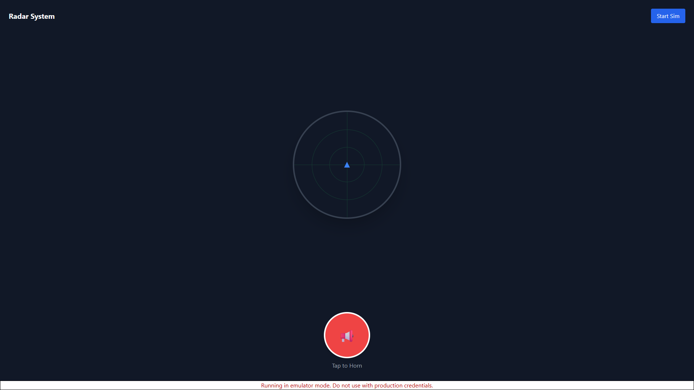
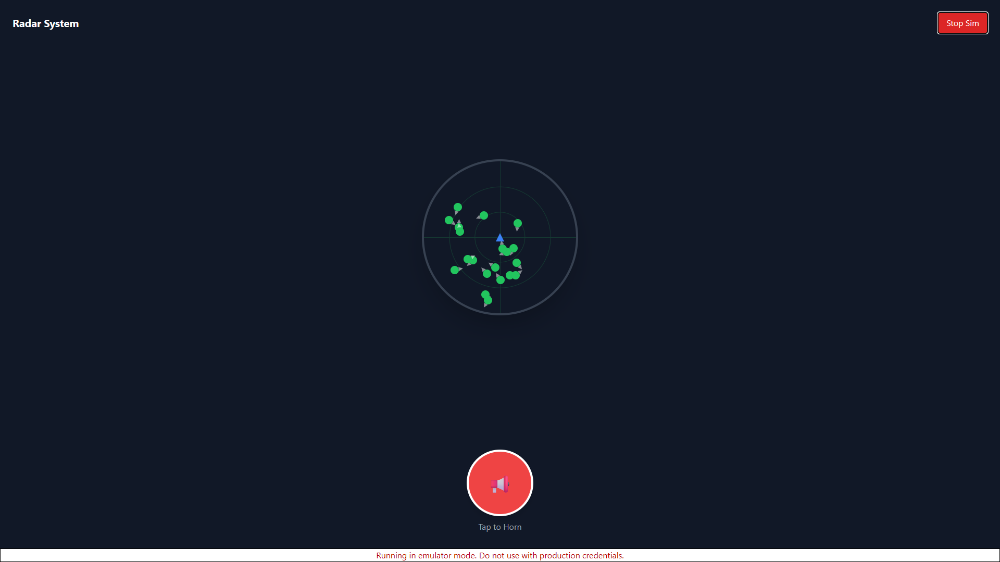
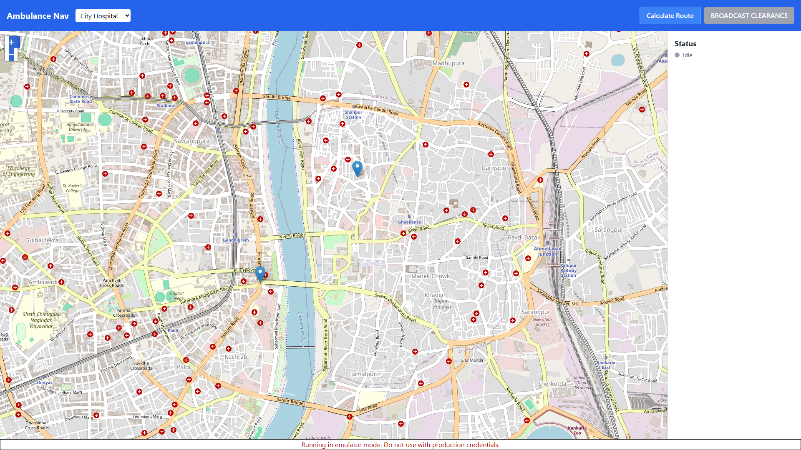
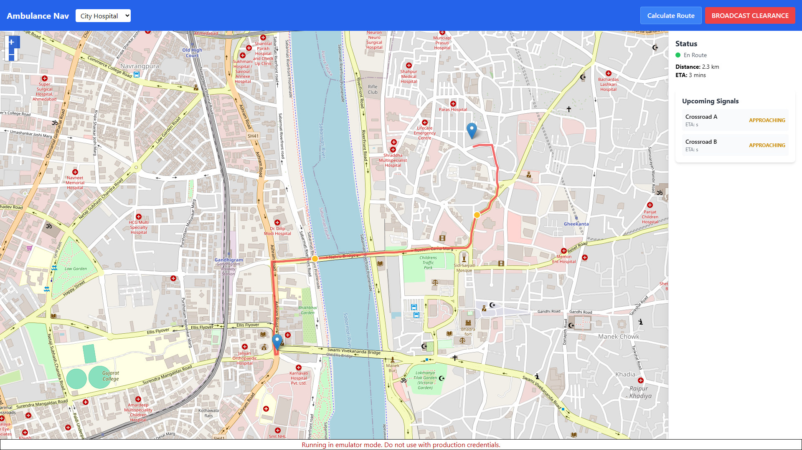
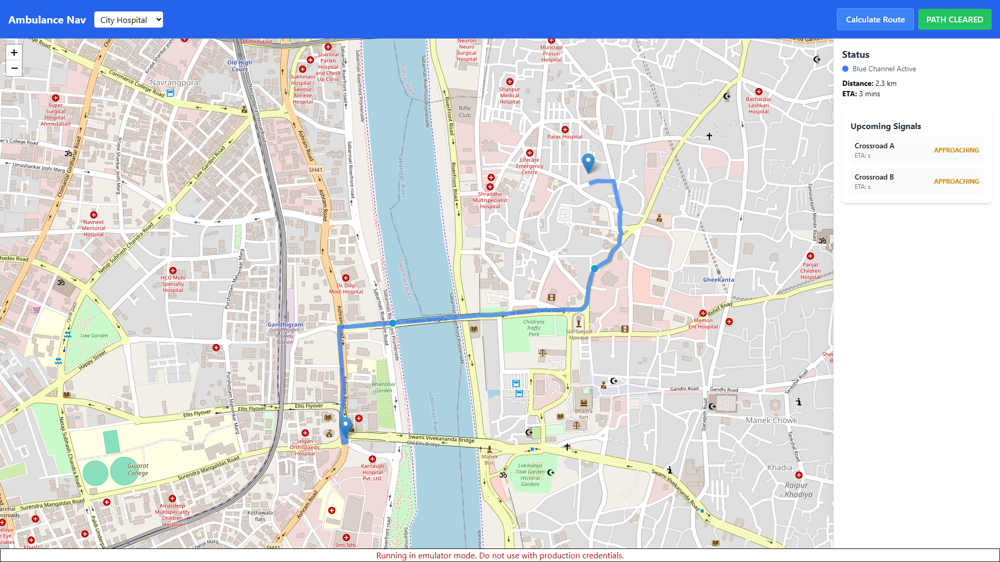
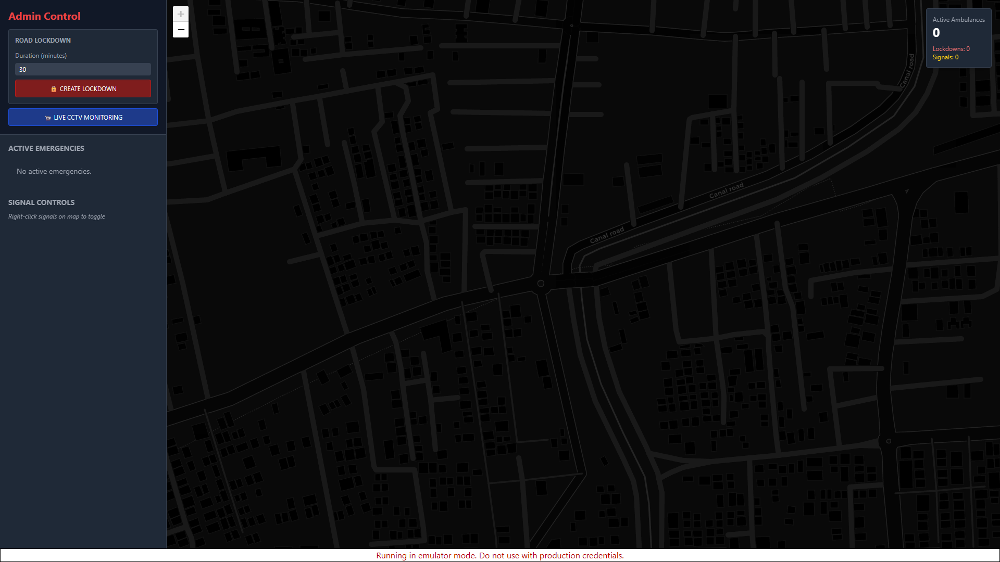
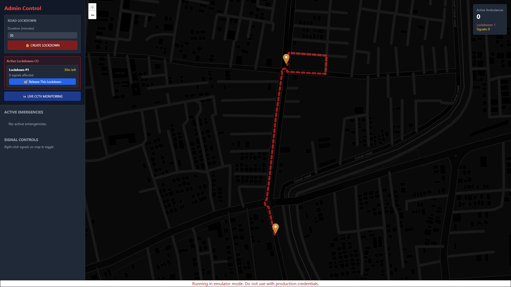

# 🚑 Smart Traffic System: Ambulance Priority & Noise-Free Horn Communication

<div align="center">

**A real-time multi-application system that reduces ambulance delays on Indian roads by enabling automated signal preemption and hornless vehicle communication.**

*The system connects Drivers, Ambulances, and Traffic Authorities with instant synchronized alerts and live routing intelligence.*

[](https://github.com/Shounak-programmer/idp)
[](LICENSE)

</div>

---

## 👨‍💻 Developer

**Shounak Chatterjee**  
Department of Computer Science & Engineering  
Adamas University

---

## 🚦 Why This Project?

In India, **thousands of emergency patients lose their life** due to delayed ambulance arrival, largely caused by traffic mismanagement.

### This system aims to:

- 🚑 **Provide ambulances fastest possible routes**
- 🚥 **Automatically clear roads ahead**
- 🔇 **Remove toxic honking noise** using silent communication
- 🏛️ **Improve visibility for traffic authorities**

> ⏱️ **Every second counts — and our system is built to save them.**

---

## 🧩 System Modules

| App | User | Purpose |
|-----|------|---------|
| **Driver Radar App** | All vehicles | Silent horn alerts + proximity awareness |
| **Ambulance Navigation App** | Paramedics | Route optimization + traffic signal clearance |
| **Admin Traffic Dashboard** | Authority | City-wide vehicle & emergency monitoring |
| **Backend** | System Core | Real-time updates + security + routing functions |
| **Simulator** | Developer tool | Generates 20–50 vehicles for demo mode |

---

## 🧠 Core Features

✅ **Hornless alert signaling** using radar visuals  
✅ **Direction-aware spatial audio** signals  
✅ **Traffic signal clearing** before ambulance arrives  
✅ **Live administrative override** for emergency routing  
✅ **Real-time database synchronization** using Firebase  
✅ **Works even in simulation mode** without GPS  

---

## 🏗️ Tech Stack

| Component | Technology |
|-----------|------------|
| **Frontend** | React, Vite, Tailwind CSS |
| **Backend** | Firebase Functions + Firestore |
| **Mapping** | Google Maps API / OpenStreetMap |
| **Logic** | Kalman Filter + Range estimation |
| **Simulator** | Randomized vehicle movement engine |
| **Audio** | Web Audio API (3D spatial alerts) |

---

## 🧱 Architecture (High-Level)

```
Driver Radar <---> Firebase <---> Ambulance Nav
       \                              /
        \                            /
         \----------- Admin --------/
                     |
              Traffic Signals
```

---

## 📸 Demonstration

### 🚘 Driver Radar System

<details>
<summary><b>View Screenshots</b></summary>

| State | Screenshot |
|-------|------------|
| **Idle** |  |
| **Simulation Active** |  |

</details>

### 🚑 Ambulance Navigation System

<details>
<summary><b>View Screenshots</b></summary>

| State | Screenshot |
|-------|------------|
| **Idle** |  |
| **En-Route with signals shown** |  |
| **Clearance Broadcast Activated** |  |

</details>

### 🏛️ Admin Control Dashboard

<details>
<summary><b>View Screenshots</b></summary>

| State | Screenshot |
|-------|------------|
| **Monitoring Active Vehicles** |  |
| **Road Lockdown Feature** |  |

</details>

---

## 🛠️ How to Run (Local Emulator Mode)

### 1. Install Dependencies

```bash
npm run install:all
```

### 2. Start All Services

```bash
# Terminal 1 - Start Firebase emulators (optional)
npm run dev:backend

# Terminal 2 - Driver App
npm run dev:driver      # http://localhost:5173

# Terminal 3 - Ambulance App
npm run dev:ambulance   # http://localhost:5174

# Terminal 4 - Admin Dashboard
npm run dev:admin       # http://localhost:5175
```

### 3. Configuration (Optional)

Add Maps + Firebase credentials in `.env` files:

```env
VITE_FIREBASE_API_KEY=your_api_key
VITE_FIREBASE_AUTH_DOMAIN=your_project.firebaseapp.com
VITE_FIREBASE_PROJECT_ID=your_project_id
VITE_GOOGLE_MAPS_KEY=your_maps_key
```

> 📖 See [START_HERE.md](START_HERE.md) for detailed setup instructions

---

## 🔮 Future Enhancements

| Feature | Impact |
|---------|--------|
| **AI-powered congestion prediction** | Smarter routing |
| **CCTV-based traffic density detection** | Dynamic signal timing |
| **Vehicle-to-Vehicle UWB** | Higher positional accuracy |
| **Hospital live capacity sync** | Better emergency triage |
| **Government API integration** | Nationwide deployment |

---

## 📚 Academic Context

This project is submitted under:

**Inter-Disciplinary Project (IDP)**  
Department of CSE, Adamas University

---

## 📌 Status

✅ **Prototype working** (Full demo available)  
🚧 **Hardware & city integration** — Next stage

---

## ⭐ Support This Project

**If you believe in this mission, please star the repo!**

Every star helps bring attention to this life-saving technology.

---

## 📬 Contact

For research collaboration or technical inquiries:

📧 **shhounakchatterjee@gmail.com**  
🔗 **[GitHub Profile](https://github.com/Shounak-programmer)**

---

<div align="center">

### 💙 Impact Statement

> **"No one should die because the ambulance got stuck in traffic."**

---

Made with ❤️ for saving lives | © 2025 Shounak Chatterjee

</div>
